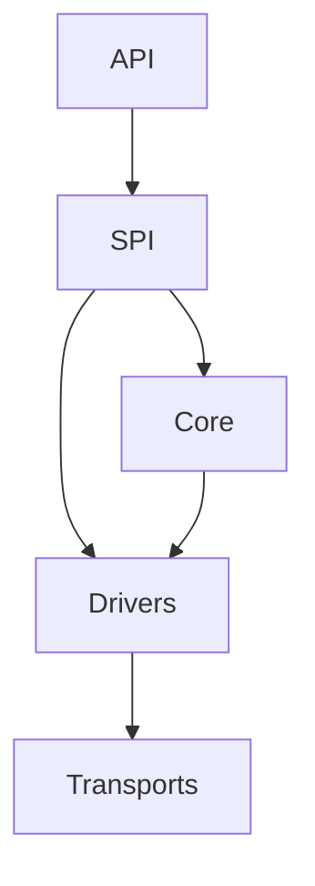
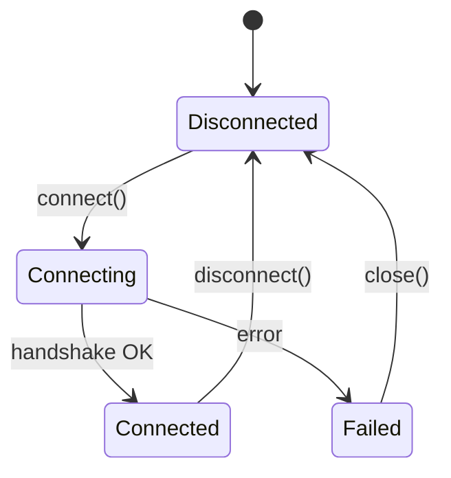
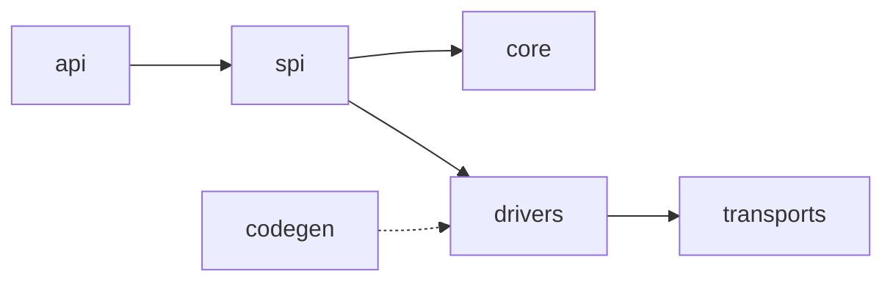
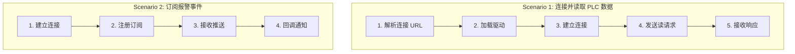
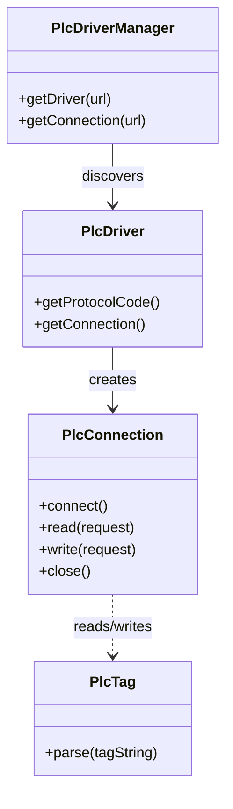
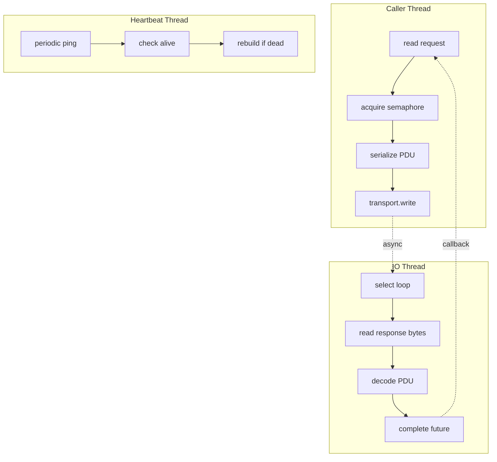
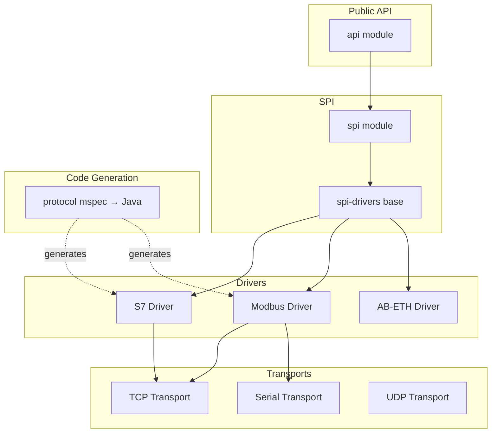
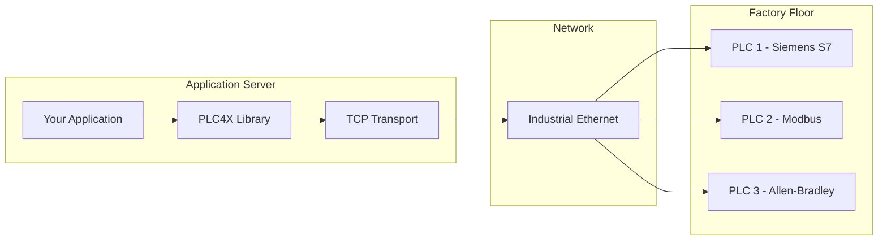

# Codebase Analysis Methodology

A logical, top-down approach to understanding any codebase. The 7 steps are
sequential — each builds on the previous one's findings. The core insight:
**a project exists to solve problems; code is merely the implementation of
those solutions.** Always start from the "why", not the "how".

---

## Step 1: Problem Statement (这个项目解决什么问题)

**Goal**: Understand WHY this project exists, before looking at any code.

### 1.1 Where to Find Answers

| Source                             | What to extract                            |
| ---------------------------------- | ------------------------------------------ |
| `README.md`                        | Project tagline, "Why" section, motivation |
| `docs/`                            | Design docs, architecture rationale        |
| Project website / wiki             | Mission statement, target users            |
| Git commit history (first commits) | Original intent                            |
| Issue tracker (GitHub/JIRA)        | Pain points being addressed                |

### 1.2 Questions to Answer

- What domain does this project serve? (industrial automation, web framework,
  database, messaging, etc.)
- What pain existed before this project? (fragmentation, no unified API,
  performance, vendor lock-in)
- Who are the target users? (developers, operators, enterprises)
- What makes this project different from alternatives?

### 1.3 Output Format

```markdown
## 项目解决的问题

### 背景

<domain context, industry landscape>

### 痛点

1. <pain point 1>
2. <pain point 2>
3. <pain point 3>

### 项目定位

<one-paragraph statement of what this project does to address the pain>
```

### 1.4 Example (PLC4X)

> **背景**: 工业自动化领域有数百种 PLC 品牌（Siemens, Allen-Bradley,
> Modbus...），每家的协议不同，开发者要为每种 PLC 写专门的通信代码。
>
> **痛点**: 1) 没有统一 API，切换 PLC 品牌要重写通信层；2) 协议闭源、
> 文档稀缺；3) Java 生态缺乏成熟的工业通信库。
>
> **定位**: 提供统一的 PLC 通信 API，一套代码支持所有品牌 PLC。

---

## Step 2: Feature Inventory (主要功能 → 对应解决的问题)

**Goal**: Map each feature to a problem from Step 1. Every feature must
trace back to a pain point — if it doesn't, either it's gold-plating or
you've missed a problem.

### 2.1 Feature Discovery

Scan these sources to compile a complete feature list:

| Source                   | How                                              |
| ------------------------ | ------------------------------------------------ |
| README feature list      | Usually bullet-pointed                           |
| API interfaces           | Public methods = features                        |
| Module/directory names   | Each top-level module usually = one feature area |
| CLI commands / endpoints | Each command/endpoint = one feature              |
| Documentation TOC        | Chapter titles = feature areas                   |
| Demo/example files       | Each example showcases a feature                 |

### 2.2 Feature-Problem Mapping Table

```markdown
| 功能         | 解决的问题              | 对应 Step 1 痛点 |
| ------------ | ----------------------- | ---------------- |
| 统一读写 API | 切换 PLC 品牌要重写代码 | 痛点 1           |
| 协议自动解析 | 协议闭源、文档稀缺      | 痛点 2           |
| 连接池管理   | 频繁建连开销大          | 痛点 1           |
| 订阅/通知    | 轮询效率低              | 痛点 3           |
| ...          | ...                     | ...              |
```

### 2.3 Feature Prioritization

Classify each feature:

- **Core** (must-have, project's reason for existing)
- **Important** (significant value, differentiator)
- **Supporting** (enables core features, e.g., config, logging)
- **Extended** (nice-to-have, extra coverage)

---

## Step 3: Component Analysis (核心组件及功能)

**Goal**: Identify the core components/modules and describe what each one
does (at the functional level, NOT code level yet).

### 3.1 Component Discovery

Start with the module/directory structure:

```
ls project-root/
ls project-root/src/
```

Each top-level module or major package is typically a component. Verify
against:

- Build file modules (`pom.xml` `<modules>`, `settings.gradle` `include`)
- Package structure (`com.example.project.api`, `...impl`, `...core`)

### 3.2 Component Inventory Table

```markdown
| 组件      | 路径        | 功能                    | 依赖的组件      | 被谁依赖     |
| --------- | ----------- | ----------------------- | --------------- | ------------ |
| API       | api/        | 定义公共接口契约        | 无              | SPI, drivers |
| SPI       | spi/        | 扩展点，连接 API 和实现 | API             | drivers      |
| Driver    | drivers/    | 协议驱动实现            | SPI, transports | tests        |
| Transport | transports/ | 底层 I/O 适配           | 无              | drivers      |
| Codec     | (in driver) | 协议编解码              | 无              | drivers      |
| Config    | (in spi)    | 配置管理                | API             | drivers      |
```

### 3.3 Component Dependency Diagram (mermaid)



### 3.4 Build File Verification

Read build files to confirm the component map:

- What are the declared modules?
- What are the inter-module dependencies?
- Are there build-time only modules (code-gen, test fixtures)?

---

## Step 4: Code Deep-Dive (每个组件的代码层面核心详解)

**Goal**: For each component from Step 3, explain HOW it works at the code
level. This is where you read the actual code.

### 4.1 For Each Component, Document

| Aspect                 | What to capture                                                        |
| ---------------------- | ---------------------------------------------------------------------- |
| **Entry class**        | The main class users/other components interact with (with `file:line`) |
| **Core interfaces**    | Key interfaces and their contracts                                     |
| **Key implementation** | The primary implementation class (with `file:line`)                    |
| **Design patterns**    | Which patterns are used and why                                        |
| **Data flow**          | How data enters, transforms, exits                                     |
| **Threading model**    | Which threads, async vs sync, concurrency control                      |
| **State machine**      | Lifecycle states and transitions                                       |
| **Error handling**     | Exception types, recovery, retry                                       |
| **Key algorithms**     | Any non-trivial logic worth calling out                                |

### 4.2 Code Deep-Dive Template

````markdown
### 4.X <Component Name> (<path>)

#### 入口类

`ClassName` at `path/File.java:line`

- 职责: <what it does>

#### 核心接口

```java
interface Foo {
    Bar doSomething(Baz input);  // 契约说明
}
```
````

#### 实现链路

```
PublicMethod() (final, template)
  └→ onHook() (abstract, impl provides)
       └→ codec.encode() → transport.write()
```

#### 设计模式

- **Template Method**: `read()` is final, calls `onRead()` hook — file:line
- **Builder**: `RequestBuilder` with fluent API — file:line

#### 并发模型

- 请求线程: caller thread
- 线程安全: `Semaphore` limits concurrent requests — file:line
- 异步: `CompletableFuture` for non-blocking response — file:line

#### 状态机



#### 关键代码片段

```java
// file:line — what this does and why it matters
```

````

### 4.3 Reading Strategy

| Priority | What to read | How |
|----------|-------------|------|
| 1st | Public interfaces (API surface) | Full read |
| 2nd | Abstract base classes (template methods) | Full read |
| 3rd | Core implementation classes | Full read |
| 4th | Utility/helper classes | Grep + targeted read |
| 5th | Generated code | Skim structure, don't deep-read |
| 6th | Tests | Read to understand expected behavior |

### 4.4 Cross-Component Call Stack

After documenting each component, trace one operation across components:

```mermaid
sequenceDiagram
    participant U as User Code
    participant A as API Layer
    participant S as SPI Layer
    participant D as Driver Impl
    participant C as Codec
    participant T as Transport

    U->>A: read(request)
    A->>S: delegate
    S->>D: onRead() hook
    D->>C: encode PDU
    C->>T: write bytes
    T-->>C: response bytes
    C-->>D: decode PDU
    D-->>S: response
    S-->>A: result
    A-->>U: PlcReadResponse
````

---

## Step 5: Architecture Design (整个项目的架构设计)

**Goal**: Synthesize the component analysis into a coherent architecture
overview. This is the "zoom out" step — what design decisions shape the
project as a whole?

### 5.1 Layering Architecture

```mermaid
graph TB
    subgraph "Public API Layer"
        A1[Interfaces]
        A2[Factories]
    end
    subgraph "SPI Layer"
        S1[Base Classes]
        S2[Template Methods]
    end
    subgraph "Implementation Layer"
        I1[Driver A]
        I2[Driver B]
        I3[Transport A]
        I4[Transport B]
    end
    subgraph "Protocol Layer"
        P1[Codec A]
        P2[Codec B]
    end

    A1 --> S1
    S1 --> I1
    S1 --> I2
    I1 --> P1
    I2 --> P2
    I1 --> I3
    I2 --> I4
```

### 5.2 Key Architectural Decisions

Document each major decision with: Decision → Rationale → Trade-off

```markdown
| 决策                   | 理由                           | 权衡               |
| ---------------------- | ------------------------------ | ------------------ |
| API-SPI-Impl 三层分离  | 允许第三方扩展驱动，不修改核心 | 层次多，调用链长   |
| Template Method 模式   | 统一流程控制，子类只填逻辑     | 继承耦合，不便测试 |
| ServiceLoader 发现驱动 | 零配置插件机制                 | 无依赖管理         |
| 代码生成协议层         | 协议二进制格式 → 类型安全类    | 生成代码量大       |
```

### 5.3 Design Pattern Catalog

```markdown
| 模式            | 位置                                 | 用途                |
| --------------- | ------------------------------------ | ------------------- |
| Template Method | `BaseClass.read()` → `onRead()`      | 统一流程，开放扩展  |
| Factory         | `DriverManager.getDriver()`          | 隐藏实例化细节      |
| Builder         | `ReadRequestBuilder`                 | 构建复杂请求对象    |
| Strategy        | `Transport` 接口多实现               | 切换 TCP/Serial/UDP |
| Observer        | `SubscriptionHandler`                | 事件通知            |
| Decorator       | `S7HConnection` wraps `S7Connection` | 添加 HA 冗余        |
```

### 5.4 Module Dependency Graph



---

## Step 6: 4+1 View Analysis (按业务功能进行 4+1 视图)

**Goal**: Apply the Kruchten 4+1 view model, organized by the business
features from Step 2. Each view answers a different stakeholder question.

### 6.1 The +1: Scenarios (用例视图)

Pick 2-5 key business scenarios that exercise the most important features.
Each scenario ties all 4 views together.



### 6.2 Logical View (逻辑视图)

**Stakeholder**: end-user / developer using the API
**Question**: what does the system provide, and how are responsibilities divided?

Show the key abstractions and their relationships:



### 6.3 Process View (进程视图)

**Stakeholder**: integrator / performance engineer
**Question**: how does the system execute at runtime? What threads, what
concurrency, what async?



Document:

- Thread pool configuration
- Lock / semaphore / CAS usage
- Async composition (CompletableFuture, coroutines, RxJava)
- Bottleneck identification

### 6.4 Development View (开发视图)

**Stakeholder**: developer / maintainer of this project
**Question**: how is the code organized? What modules, layers, packages?



Document:

- Module list and responsibilities
- Build order (dependency direction)
- Code generation pipeline (if any)
- Test strategy (unit, integration, mock)

### 6.5 Physical View (物理视图)

**Stakeholder**: deployer / ops engineer
**Question**: what does the deployment topology look like? What processes,
nodes, networks?



Document:

- Deployment nodes (bare metal, container, JVM)
- Network topology (LAN, WAN, industrial bus)
- External dependencies (databases, message queues)
- Scaling characteristics (stateless vs stateful)

---

## Step 7: Output Markdown Document (输出 markdown 文档)

**Goal**: Produce a single, well-structured markdown file that captures the
entire analysis.

### 7.1 Document Template

```markdown
# <Project Name> 项目分析报告

## 1. 问题陈述

### 1.1 背景

<domain context>

### 1.2 痛点

1. <pain 1>
2. <pain 2>

### 1.3 项目定位

<one paragraph>

---

## 2. 功能与问题对照

### 2.1 功能清单

| 功能 | 解决的问题 | 痛点编号 | 优先级 |
| ---- | ---------- | -------- | ------ |
| ...  | ...        | ...      | Core   |

### 2.2 功能优先级

- Core: ...
- Important: ...
- Supporting: ...

---

## 3. 核心组件

### 3.1 组件清单

| 组件 | 路径 | 功能 | 依赖 | 被依赖 |
| ---- | ---- | ---- | ---- | ------ |
| ...  | ...  | ...  | ...  | ...    |

### 3.2 组件依赖关系

<mermaid: component dependency graph>

---

## 4. 组件代码详解

### 4.1 <Component A>

<code deep-dive per template>

### 4.2 <Component B>

<code deep-dive per template>

...

### 4.N 跨组件调用链

<mermaid: sequence diagram>

---

## 5. 架构设计

### 5.1 分层架构

<mermaid: layering diagram>

### 5.2 关键架构决策

| 决策 | 理由 | 权衡 |
| ---- | ---- | ---- |

### 5.3 设计模式目录

| 模式 | 位置 | 用途 |
| ---- | ---- | ---- |

### 5.4 模块依赖图

<mermaid: module dependency graph>

---

## 6. 4+1 视图分析

### 6.1 用例视图 (Scenarios)

<mermaid: use case scenarios>

### 6.2 逻辑视图 (Logical View)

<mermaid: class diagram>

### 6.3 进程视图 (Process View)

<mermaid: process/thread diagram>

### 6.4 开发视图 (Development View)

<mermaid: module/package diagram>

### 6.5 物理视图 (Physical View)

<mermaid: deployment diagram>
```

### 7.2 File Location

- Default: project root, `<ProjectName>分析报告.md`
- If existing analysis files exist, extend/merge rather than create new

### 7.3 Mermaid Diagram Checklist

Every diagram must be valid mermaid syntax:

- [ ] Class diagrams use `classDiagram`
- [ ] Sequence diagrams use `sequenceDiagram`
- [ ] State diagrams use `stateDiagram-v2`
- [ ] Flow/graph diagrams use `graph TD` or `graph LR`
- [ ] No unclosed quotes in node labels
- [ ] Test render in a markdown viewer that supports mermaid

---

## Workflow Checklist

```
□ Step 1: 问题陈述 — README/docs/commit history → 背景痛点定位
□ Step 2: 功能清单 — API/模块/文档 → 功能-痛点映射表
□ Step 3: 组件分析 — 目录/构建文件 → 组件清单 + 依赖图
□ Step 4: 代码详解 — 读核心类 → 入口/接口/模式/并发/状态机
□ Step 5: 架构设计 — 综合组件 → 分层图/决策表/模式目录
□ Step 6: 4+1 视图 — 按业务功能 → 场景/逻辑/进程/开发/物理
□ Step 7: 输出文档 — 填充模板 → 校验 mermaid 语法
```

---

## Tool Usage Patterns

### Parallel Reading

Batch multiple file reads in a single message:

```
[read FileA.java] [read FileB.java] [read FileC.java]  ← one message, parallel
```

### Search Strategy

| Goal                  | Tool                             |
| --------------------- | -------------------------------- |
| Find files by name    | Glob (`**/*.java`)               |
| Find code by content  | Grep (`pattern`, include filter) |
| Find class definition | Grep (`class ClassName`)         |
| Find interface impls  | Grep (`implements Interface`)    |
| Understand structure  | Read directory listing first     |

### Todo Lists

Use `todowrite` when analysis spans multiple steps (almost always, given the
7-step flow).

### Task Delegation

Use the `explore` subagent for:

- Broad searches across many files
- "Where is X used?" questions
- Counting occurrences

Use the `general` subagent for:

- Multi-step research that requires reading + synthesizing

---

## Anti-Patterns (避免的做法)

| Anti-pattern                                        | Why                             | Instead                                 |
| --------------------------------------------------- | ------------------------------- | --------------------------------------- |
| Starting with code before understanding the problem | Wrong abstraction level         | Start with Step 1 (problem)             |
| Listing features without mapping to problems        | Features seem arbitrary         | Always use Step 2 mapping table         |
| Reading files sequentially one by one               | Slow, wastes context            | Batch parallel reads                    |
| Reading entire large files                          | Token waste                     | Grep first, then read relevant sections |
| Guessing at patterns without verification           | Wrong conclusions               | Always read the code                    |
| Explaining concepts without code context            | Generic, unhelpful              | Use actual codebase snippets            |
| Creating new docs when existing ones exist          | Duplication                     | Read existing docs first, edit/extend   |
| No file:line references                             | Reader can't navigate           | Always include `file:line`              |
| ASCII art instead of mermaid                        | Not renderable, not standard    | Use mermaid for all diagrams            |
| Skipping 4+1 views                                  | Misses stakeholder perspectives | Complete all 5 views                    |

---

## Adaptation Notes

- **Small projects** (< 10 files): Merge Steps 3+4 into one pass. Skip 4+1
  views that don't apply (e.g., a CLI tool may not have a meaningful physical
  view).
- **Non-Java projects**: Same 7 steps apply. Adjust tooling (e.g., `cargo`,
  `npm`, `pip` instead of `mvn`/`gradle`). Class diagrams adapt to the
  language's paradigm (e.g., module diagrams for Go, package diagrams for
  Python).
- **Greenfield projects**: Step 1 focuses on intended architecture rather
  than existing code. Steps 2-3 describe the plan. Skip Step 4 until code
  exists.
- **PR review**: Focus on Steps 3-4 (what components changed, how the code
  works) and Step 6 (does the change fit the architecture?).
- **Library vs Application**: Libraries emphasize Logical + Development
  views; Applications emphasize Process + Physical views.
